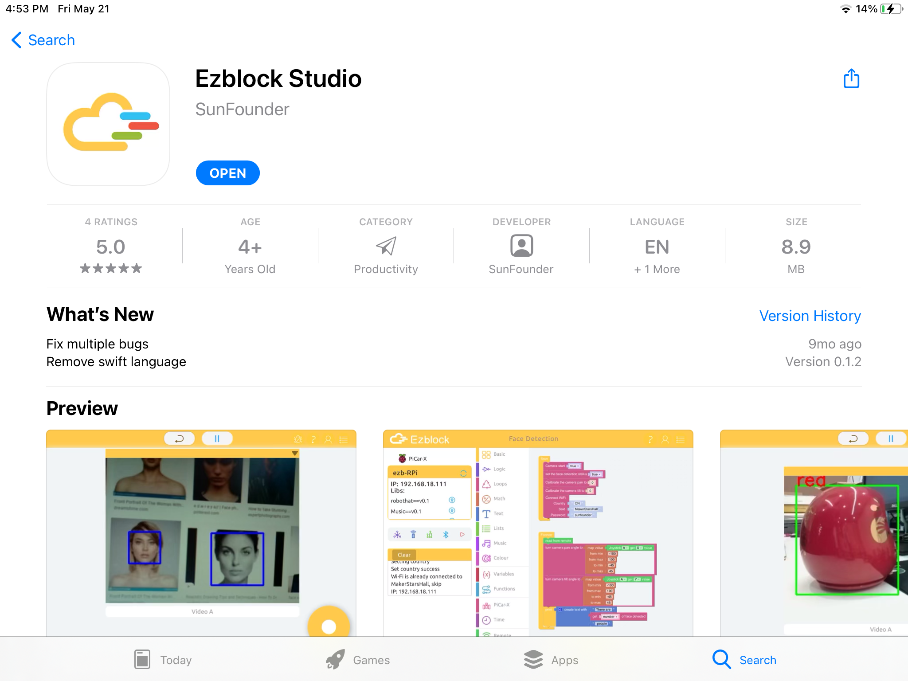

Quick User Guide for Ezblock 3.0
=====================================

About Ezblock 3
----------------------

The biggest optimization of Ezblock App upgrade from Ezblock 2 to Ezblock 3 is to modify the communication method, v2.0 uses **Bluetooth communication**, Ezblock 3 uses **Websocket communication**, which is network communication.

Ezblock 3's network communication speed will be much faster than Ezblock 2; for the Ezblock 3 version, we have also optimized and improved the connection process and almost all interfaces to make the APP more smooth and easy to use.

The Ezblock 3 version should be used with the Ezblock 3 image (`Ezblock Studio Download Center <https://ezblock.cc/download/index.html>`_.). The v3.0 version is currently in the public test stage. 

If there is a problem during use, please send an email to us, and we will test it several times to ensure that there is no problem in use.

Here is the Email: cs@sunfounder.com.

Download and Write Ezblock 3 image
------------------------------------

1. Prepare the tool of image burning. Here we use the Etcher. Now，download the software from here: `Etcher <https://www.balena.io/etcher/>`_.

2. Download the **Raspberry Pi OS for Ezblock 3 Beta** image file here: `Ezblock Studio Download Center <https://ezblock.cc/download/index.html>`_.

3. Unzip the package downloaded and you will see the .img file inside.

.. note::
    Do not extract the .img file.

4. With Etcher, flash the image file into the Micro SD card.

    .. image:: img/burning1.png
        :width: 600
        :align: center

5. At this point, Ezblock for Raspberry Pi is installed. Please insert the Micro SD card into your Raspberry Pi.

    .. image:: img/burning2.png
        :align: center

Install Ezblock Studio
-------------------------------

**Ezblock Studio** is a development platform developed by SunFounder designed for beginners to lower the barriers to getting started with Raspberry Pi. 

It has two programming languages: Graphical and Python, and available on almost all different types of devices.

With Bluetooth and Wi-Fi support, you can download code, remote control a Raspberry Pi, on Ezblock Studio.

Open App Store (iOS/Mac OS X system) or Play Store (Android/Windows/Linux system), then search and download Ezblock Studio.

How to enter the V3.0 version?
----------------------------------

1. Open Ezblock Studio and log in to your account.
2. Go to your account page by clicking on your avatar in the upper right corner of the home page.
3. Go to the **Setting** page, and then click **About Version**.

    .. image:: img/imgIMG_0381.PNG
        :width: 600
        :align: center

4. Click **Enter a new version** in the pop-up window.

    .. image:: img/imgIMG_0382.PNG
            :align: center

5. A new pop-up window will appear , select **Enter a new version** again.

    .. image:: img/imgIMG_0383.PNG
        :align: center

6. After a few minutes of loading, you will enter the V3.0 version.

How to connect the robot and Ezblock Studio?
------------------------------------------------------

1. At this time, there is a pop-up window with an empty device list. You need to power on your robot and turn on the Bluetooth of your mobile device at the same time, then the robot number will appear.

    .. image:: img/imgIMG_0388.PNG
        :align: center

2. Click **Done** in the upper right corner, and after a while, **Connection Successful** will appear.

    .. image:: img/imgIMG_0391.PNG
        :align: center

3. At this point you need to click **OK** to quickly configure your robot.

    .. image:: img/imgIMG_0395.PNG
        :align: center

4.  Enter your Wi-Fi account and password.

    .. image:: img/imgIMG_0396.PNG
        :align: center
5.  Choose the product corresponding to your robot.

    .. image:: img/imgIMG_0398.PNG
        :align: center

6.  Enter a name for your robot.

    .. image:: img/imgIMG_0399.PNG
        :align: center

7.  If your robot needs to be calibrated, there will be a prompt telling you that you can enter the calibration page by clicking **Calibration**. If it is not needed, the pop-up window disappears and returns to the home page.

    .. image:: img/imgIMG_0401.PNG
        :align: center
8.  The calibration page of each product is different, but there is a reminder which part needs to be calibrated. You can click the corresponding part, and then refer to the **Calibration Help** to calibrate. After the calibration is completed, click **Comfirm**.

    .. image:: img/imgIMG_0403.PNG
        :align: center

How to Open and Run examples?
-----------------------------------
1. On the homepage, click Examples to enter the Examples page. If you just need to simply test these examples, you only need to click **RUN** to make your robot work.

    .. image:: img/imgIMG_0392.PNG
        :align: center

2. If you want to view and modify the code inside, then you need to click **Edit**. The following picture is the programming page.

    .. image:: img/imgIMG_0393.PNG
        :align: center

How to go back to V2.0?
------------------------

1. If you are not used to the V3.0 version of Ezblock, then you can go back to the V2.0 version.
2. Click the **menu** icon in the upper right corner of the homepage.

    .. image:: img/imgIMG_0406.png
        :align: center

3. Click **About this App**.

    .. image:: img/imgIMG_0405.png
        :align: center

4. Click **Head to EzBlock version 2.5** to jump to v2.0 version!

    .. image:: img/imgIMG_0404.png
        :align: center